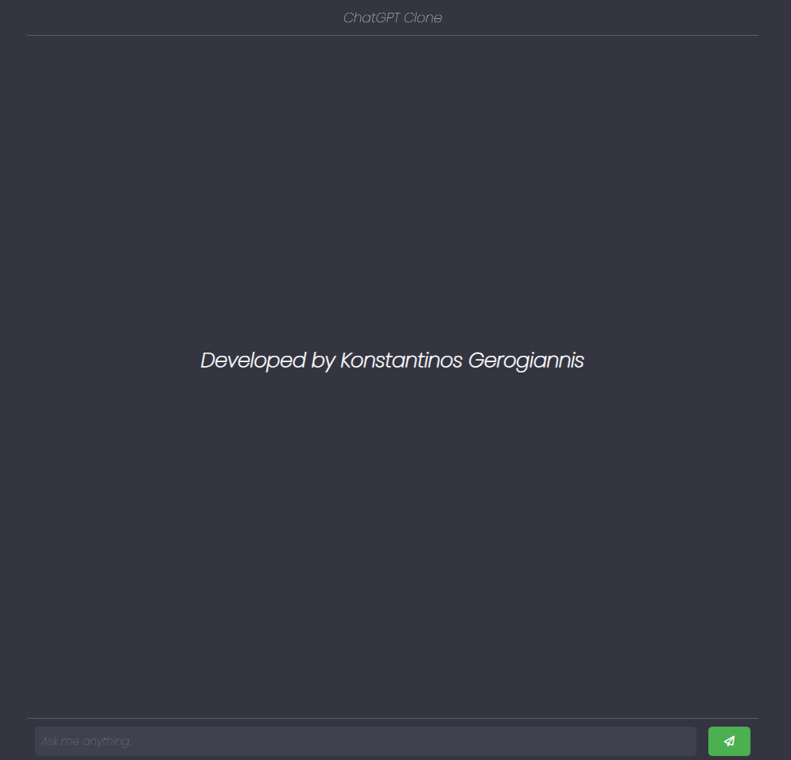

# ChatGPT_Clone
 A simple javascript project, cloning chatgpt with an unnoficial chatgpt api request.
(You need to add an api key to fetch a request. You can find it on the link below)
This is the api used.
[API](https://rapidapi.com/haxednet/api/chatgpt-api8/)

<h1> Screenshots </h1>

